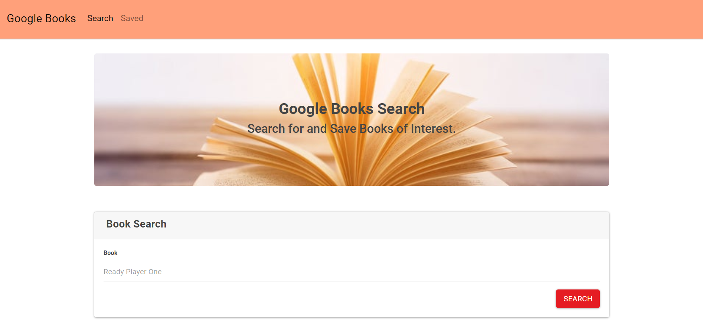
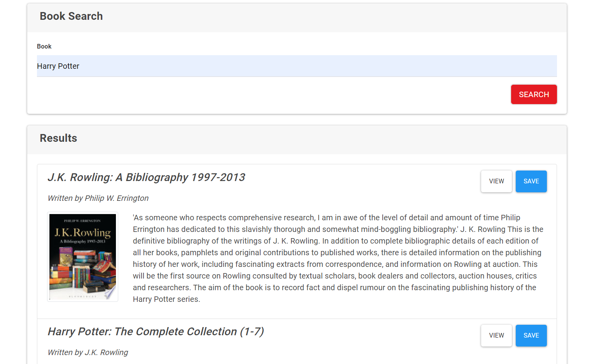
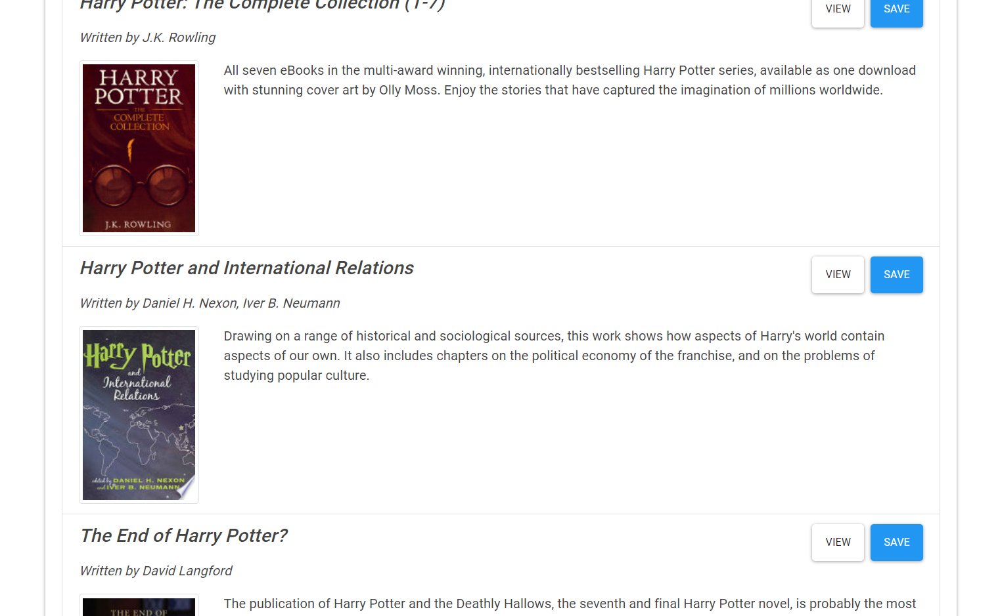
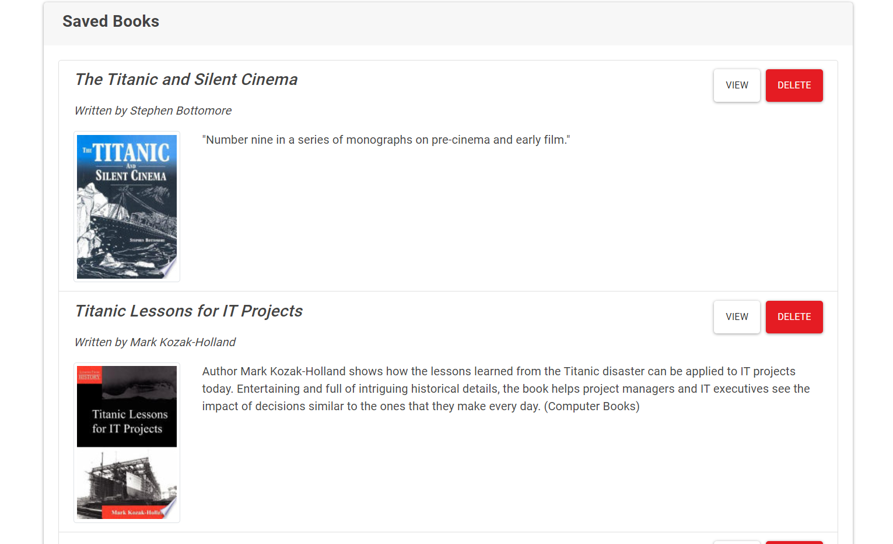

# Google Books Search

### Overview

This is a React-based Google Books Search application. This app create by React components, work with helper/util functions, and utilize React lifecycle methods to query and display books based on user searches. Also use Node, Express and MongoDB so that users can save books to review or purchase later.

### Instructions

* This application have minimum 2 pages.

  * Search page - User can search for books via the Google Books API and render them here. User has the option to "View" a book, bringing them to the book on Google Books, or "Save" a book, saving it to the Mongo database.

  * Saved page - Renders all books saved to the Mongo database. User has an option to "View" the book, bringing them to the book on Google Books, or "Delete" a book, removing it from the Mongo database.

### Install and Run

 * Run `npm install` for get `node_modules` and `package-lock.json`
 * Run `npm start` for start application and react

** At a minimum, books should have each of the following fields:

* `title` - Title of the book from the Google Books API

* `authors` - The books's author(s) as returned from the Google Books API

* `description` - The book's description as returned from the Google Books API

* `image` - The Book's thumbnail image as returned from the Google Books API

* `link` - The Book's information link as returned from the Google Books API

** Add the following Express routes for your app:

* `/api/books` (get) - Should return all saved books as JSON.

* `/api/books` (post) - Will be used to save a new book to the database.

* `/api/books/:id` (delete) - Will be used to delete a book from the database by Mongo `_id`.

* `*` (get) - Will load your single HTML page in `client/build/index.html`. Make sure you have this _after_ all other routes are defined.

### Home page

### Search for a book

### Show the Result 

### Save a book page (You and view more information about a book and delete it too)

